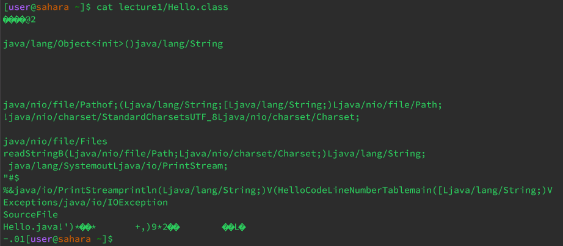

# Lab Report 1 - Remote Access and FileSystem (Week 1)

Some of the commands we used today are `cd`, `ls`, and `cat`. We will explore the characteristics of each command by running each with *no* arguments, passing a path to a *directory*, and passing a path to a *file*.

## The `cd` command

1. Running the command with no arguments  
Running the command `cd` in the home directory appears to result in no change:
```
[user@sahara ~]$ cd
[user@sahara ~]$
```
However, running the command while in a different working directory, like `lecture1`, the action is clear:
```
[user@sahara ~/lecture1]$ cd
[user@sahara ~]$ 
```
Using `cd` with no arguments is the same as passing in the home directory. No matter what working directory you are in, running `cd` will take you to the home directory.

2. Running the command with a directory  
Running the command `cd lecture1` while in the home directoty will change the working directory to `lecture1`.
```
[user@sahara ~]$ cd lecture1
[user@sahara ~/lecture1]$
```
We can see the the working directory has changed on the second line. This is the expected output.

3. Running the command with a file  
Running the command `cd lecture1/Hello.java` while in the home directoy results in an error.
```
[user@sahara ~]$ cd lecture1/Hello.java
bash: cd: lecture1/Hello.java: Not a directory
```
This is an error because the command line explicitly tells us that the argument passed is not one that it accepts. `cd` only works with directories so passing a file will result in an error.

## The `ls` command

1. Running the command with no argument  
Running `ls` while in the home directoy will print the files within the current folder.
```
[user@sahara ~]$ ls
lecture1
```
Since the only folder within the working directory is `lecture1`, that is the only item that is printed. Similarly, running `ls` while in the `lecture1/` folder will list the contents in that folder.

2. Running the command with a directory  
Running `ls lecture1` while in the home directory prints the contents of the `lecture1` folder.
```
[user@sahara ~]$ ls lecture1/
Hello.class  Hello.java  messages  README
```
The `ls` command prints the contents of a directory. Therefore, passing a path to a folder in the command will print the contents of the given folder. 

3. Running the command with a file  
Running `ls lecture1/Hello.java` while in the home directory simply prints the given path.
```
[user@sahara ~]$ ls lecture1/Hello.java
lecture1/Hello.java
```
`ls` prints the contents within a given path. Since the path is to file, and the only content within that path is the file, it will print the path.

## The `cat` command

1. Running the command with no arguments  
Running `cat` (regardless of working directory) results in the command line being stuck in a loop. The command will run infinitely where any argument passed is repeated, and the command only ends when forfcefully terminated.
```
[user@sahara ~]$ cat
test
test
lecture/Hello.java
lecture/Hello.java
^C
[user@sahara ~]$
```
This is intentional, by certain UNIX design choices outside of my understanding, and is therefore not an error.

2. Running the command with a directory  
Running `cat lecture1` while in the home directory results in an error.
```
[user@sahara ~]$ cat lecture1/
cat: lecture1/: Is a directory
```
The `cat` command is unable to print the "contents" of a folder because the folder itself does not have any text. It may contain text documents, but the folder itself has no text, and therefore reuslts in an error.

3. Running the command with a file  
Running `cat lecture1/messages/en-us.txt` while in the home directory prints the contents of the `en-us.txt` file.
```
[user@sahara ~]$ cat lecture1/messages/en-us.txt
Hello World!
```
As expected, the `cat` command prints the data within a file. This can also work for files that don't only contain text, like the `Hello.class` file which contains binary data. Here is the output: 


---

This concludes a deep dive into the `cd`, `ls`, and `cat` commands.

