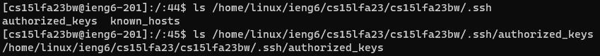

# Lab Report 2 - Servers and SSH Keys


## Part 1
### StringServer Code:
```
class Handler implements URLHandler {
    String str = "";
    int len = 0;

    public String handleRequest(URI url) {
        if (url.getPath().equals("/")) {
            return str;
        } else {
            if (url.getPath().contains("/add-message")) {
                String[] parameters = url.getQuery().split("=");
                if (parameters[0].equals("s")) {
                    buildString(parameters[1]);
                }
                return str;
            }
            return "404 Not Found!";
        }
    }

    private void buildString(String inputString) {
        if (len == 0) {
            str = "1. " + inputString + "\n";
            len++;
        } else {
            str = str + String.valueOf(len + 1) + ". " + inputString + "\n";
            len++;
        }
    }
}

class StringServer {
    public static void main(String[] args) throws IOException {
        if(args.length == 0){
            System.out.println("Missing port number! Try any number between 1024 to 49151");
            return;
        }


        int port = Integer.parseInt(args[0]);


        Server.start(port, new Handler());
    }
}
```

### /add-message Usage:

- The methods that are called are `handleRequest` and `buildString`.
- `handleRequest` takes in the inputted url, which in the image is `localhost:8100/add-message?s=Hello`. `buildString` takes in the string argument contained within the url. Before the request is processed, `str` is "" and `len` is 0. After, they become "1. Hello\n" and 1, respectively.
- By the end of `buildString`, the variables `str` and `len` will now include the new string and update the length, respectively.


- Similar to the previous image, `handleRequest` and `buildString` are called.
- The URL passed into `handleRequest` is `localhost:8100/add-message?s=How are you`. The string passed into `buildString` is "How are you". `str` becomes "1. Hello\n2. How are you\n" and `len` becomes 2.
- `str` appends the string from the url and `len` gets incremented to count the new string.

## Part 2

### Private Key


### Public Key


### SSH


## Part 3
One thing that I learned is how to remotely connect to a server via the terminal. Along with that functionality comes other tools to make working with it simpler. This includes ssh keys and various command, of which we only learned of scp.