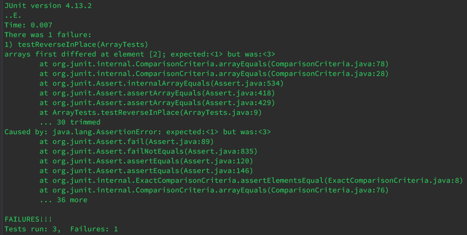
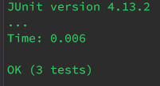

# Lab Report 3 - Bugs and Commands

## Part 1 - Bugs
Focusing on the ReverseInPlace method, one buggy input would be the array {1, 2, 3}. Here is how it looks within a test:
```
public void testReverseInPlace() {
	int[] input1 = {1, 2, 3};
	ArrayExamples.reverseInPlace(input1);
	assertArrayEquals(new int[]{3, 2, 1}, input1);
}
```

An input that would not induce failure would be the array {1, 2}. In a test:
```
public void testReverseInPlace() {
	int[] input1 = {1, 1};
	ArrayExamples.reverseInPlace(input1);
	assertArrayEquals(new int[]{1, 1}, input1);
}
```

Here is the output of running each test. The first input:  


And the second input:  


This is what the code looks like before adjusting it:
```
static void reverseInPlace(int[] arr) {
    for(int i = 0; i < arr.length; i += 1) {
        arr[i] = arr[arr.length - i - 1];
    }
}
```

After adjustments:
```
static void reverseInPlace(int[] arr) {
    for(int i = 0; i < (arr.length / 2); i += 1) {
        int hold = arr[arr.length - i - 1];
        arr[arr.length - i - 1] = arr[i];
        arr[i] = hold;
    }
}
```

This fixes the bug because the old code simply copies/mirrors the second half of the array into the first. This means that the input of {1, 2, 3} would return {3, 2, 3}. The new code properly swaps the elements instead of copying over, and only traverses half the array to avoid swapping twice.

## Part 2 - Researching Commands

The command of choice is the `grep` command. 

### `-r` option  
This option recursively searches a directory and its subdirectories. 

Example 1:  
```
$ grep -r "sophisticated" 911report/
911report/chapter-3.txt:                become more sophisticated. These changes have made surveillance and threat warning
911report/chapter-3.txt:                sophisticated adversaries. There were therefore numerous restrictions on handling
911report/chapter-5.txt:                tradecraft was not especially sophisticated, but it was good enough. They moved,
911report/chapter-8.txt:                wrote that this was all too sophisticated to be merely a psychological operation to
911report/chapter-8.txt:                and conceal sophisticated explosive devices in luggage and consumer products.
911report/chapter-9.txt:                sophisticated computerized fire alarm system with redundant electronics and control
911report/chapter-9.txt:                planes, the capability of the sophisticated building systems may have been impaired.
911report/preface.txt:            We learned about an enemy who is sophisticated, patient, disciplined, and lethal. The
```
Here, all files within the `911report` directory are searched for the pattern. It is functionally the same as `grep "sophisticated" 911report/*`, but is less likely to result in an error.   

Example 2:
```
$ grep -r "vow" government/
government/Media/Free_legal_service.txt:Budget cut by $50,000, but attorney vows central Illinois poor
government/Media/Free_legal_service.txt:attorney Lisa Y. Wilson vows that poor central Illinoisans will
```
Here, all files *and subdirectories* are searched. Using `government/*` in this case will result in an error since `government/` only contains directories, which won't be searched.  

(Source: [GNU Manual](https://www.gnu.org/software/grep/manual/grep.html))

### `-v` option
This option will invert the matchmaking, returning lines *without* the pattern.  

Example 1:
```
$ grep -v "r" plos/pmed.0020191.txt


        comments [2] implied that they took a position on this issue.


```
Here, all the lines *not* containing "l" are returned, including lines with whitespace.   

Example 2:
```
$ grep -v " $" plos/pmed.0020191.txt

        The excellent article by Jordan Paradise, Lori B. Andrews, and colleagues, “Ethics.
        Constructing Ethical Guidelines for Biohistory” [1], neither advocates nor argues against
        biohistorical research; instead, it points out that such investigations are currently
        taking place without guidelines—ethical, scientific, moral, or religious. The question
        remains: if such guidelines were to be established, what individuals, institutions,
        governments, medical examiners, family members, or intrepid biographers are to be given
        permission? Who is to decide what is “historically significant”? Not to mention the
        meta-question: who is to decide who is to decide? I apologize to the authors if my brief
        comments [2] implied that they took a position on this issue.

```
Here, all lines ending in spaces are filtered (but not ones containing newline characters). Since many files contain large chunks of empty space, this can help remove it.  

(Source: [GNU Manual](https://www.gnu.org/software/grep/manual/grep.html))

### `-h` option
This option only prints the lines matching the pattern, not including the filenames. 

Example 1:
```
$ grep -h "sophisticated" 911report/*
                become more sophisticated. These changes have made surveillance and threat warning
                sophisticated adversaries. There were therefore numerous restrictions on handling
                tradecraft was not especially sophisticated, but it was good enough. They moved,
                wrote that this was all too sophisticated to be merely a psychological operation to
                and conceal sophisticated explosive devices in luggage and consumer products.
                sophisticated computerized fire alarm system with redundant electronics and control
                planes, the capability of the sophisticated building systems may have been impaired.
            We learned about an enemy who is sophisticated, patient, disciplined, and lethal. The
```
Here, we notice only lines matching the pattern are printed. This can help surverying file content.  

Example 2:
```
$ grep -hr "Clinton" government/
in 1986. He took a leave of absence in 1994 to join the Clinton
civilian, and reserve attorneys. In 1994, President Clinton
retirement. For example, President Clinton's 2000 Retirement
32President Clinton's 1999 Universal Savings Accounts (USA)
Clinton modified President Reagan«s policy by requiring the agency
which was established at the request of President Clinton in the
Clinton«s Task Force on Health Care Reform and was provided with an
"The current Clinton-appointed board has thumbed its nose at
the Clinton administration in 1996 and by the Bush administration
inaugurated by President Clinton and some other Democrats. But even
```
Here, we combine `-h` with `-r` to survery all of `government/`.  

(Source: [GNU Manual](https://www.gnu.org/software/grep/manual/grep.html))

### `-c` option
This option prints the amount of lines matching the pattern within a file(s).  

Example 1:
```
$ grep -c "DNA" biomed/1471-213X-1-11.txt
1
```
Here, we see the number of lines matching the pattern within the given file is 1. This can tell us the expected content within a file.  

Example 2:
```
$ grep -c "DNA" biomed/1471-213X-1*
biomed/1471-213X-1-1.txt:1
biomed/1471-213X-1-10.txt:10
biomed/1471-213X-1-11.txt:1
biomed/1471-213X-1-12.txt:2
biomed/1471-213X-1-13.txt:0
biomed/1471-213X-1-15.txt:21
biomed/1471-213X-1-2.txt:18
biomed/1471-213X-1-3.txt:2
biomed/1471-213X-1-4.txt:8
biomed/1471-213X-1-6.txt:0
biomed/1471-213X-1-9.txt:20
```
Here, the command is used with multiple files, returning the match count for each. It can help locate files with content we need.  

(Source: [GNU Manual](https://www.gnu.org/software/grep/manual/grep.html))