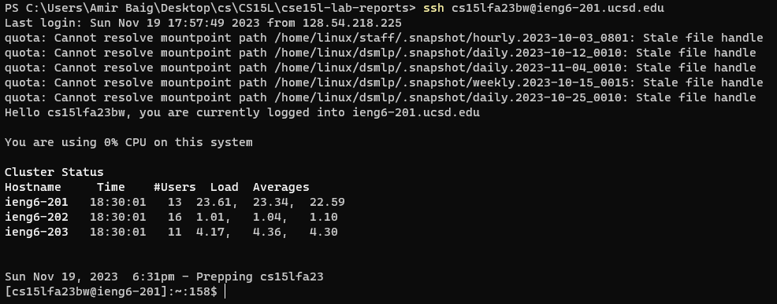
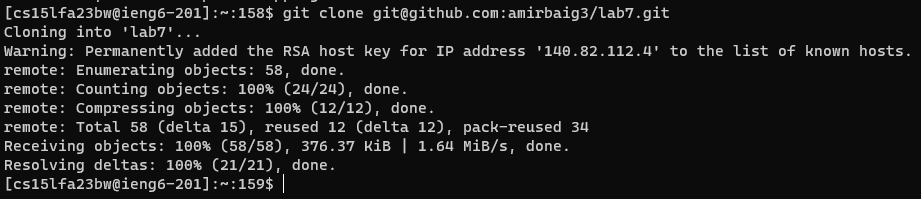
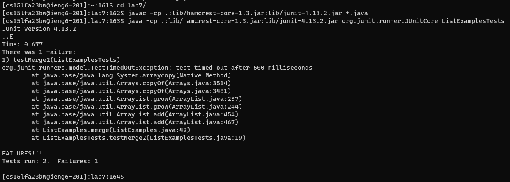
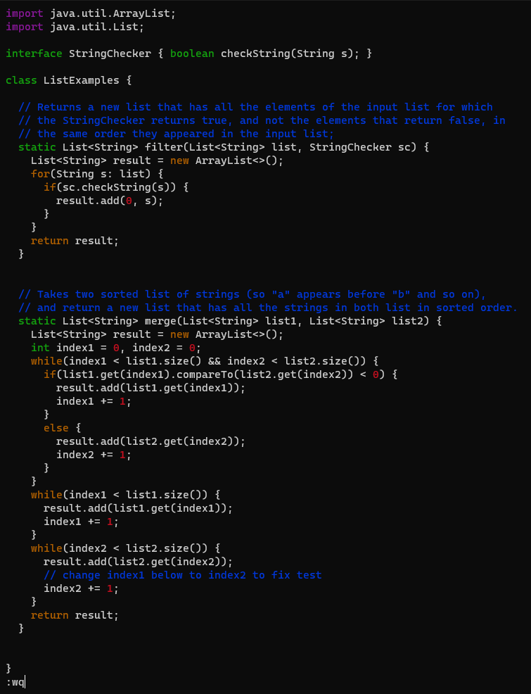
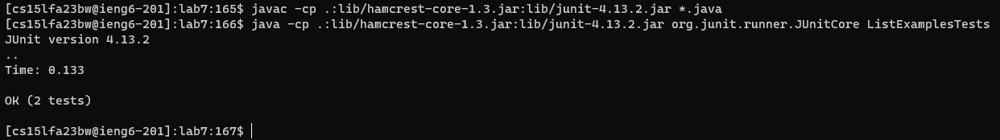
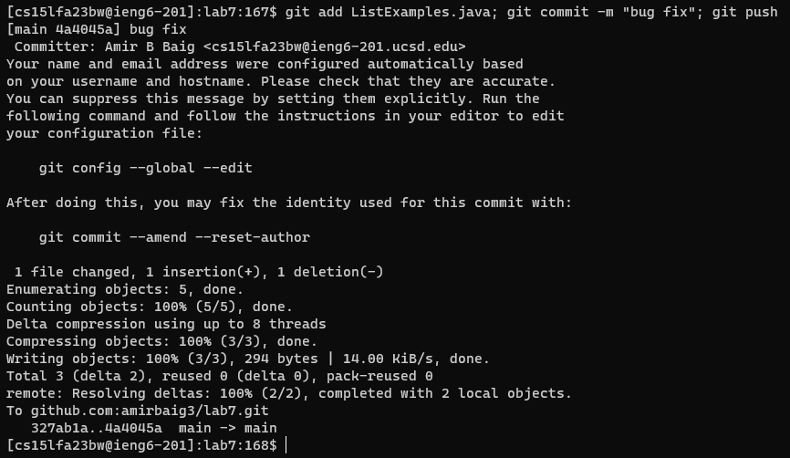

# Lab Report 4 - Vim

**Keys pressed:** `<up><enter>`  
The `ssh` command was first in the history, so only one `<up>` was needed to access it.

**Keys pressed:** `git clone ^v<enter>`  
Simply typing out the clone command and pasting the repo link.

**Keys pressed:** `cd l<tab><enter><up><up><up><up><enter><up><up><up><up><enter>`  
Typing out `cd l` and tabbing autocompletes to `lab7/` since there are no other items that start with 'l'. Both the `javac` and `java` commands were four up in the history, so pressing `<up>` for each accesses both.

**Keys pressed:** `vim L<tab>.j<tab>i<backspace>2<esc>:wq<enter>`  
First run the `vim` command by typing the filename. `L` will autocomplete to `ListExamples` then typing `.j<tab>` after will get the full filename, `ListExamples.java`. Within Vim, my cursor was already on top of "index1", so movement was needed. (Not sure if that is expected behavior, or something to do with Windows Terminal.) Press `i` to enter insert mode and replace '1' with '2'. Exit with `<esc>` and save and quit with `:wq<enter>`.  

If my cursor was at the top of the file, I would press `G6ker2:wq<enter>` while inside Vim. This would have the effect:
- `G` - move cursor to end of file
- `6k` - move cursor 6 lines up
- `e` - move cursor to end of next word (index1, in this case)
- `r2` - replace character at cursor with '2'
- `:wq<enter>` save and quit  
  

**Keys pressed:** `<up><up><up><enter><up><up><up><enter>`  
Since the `javac` and `java` commands are now only 3 up in the history, only 3 arrow key presses are needed to access and run them.

**Keys pressed:** `git add L<tab>; git commit -m "bug fix"; git push`  
Typing out each git command into one bash command saves the need to execute each one individually. Tabbing 'L' will autocomplete to `ListExamples.java`, although I would not expect it to.
