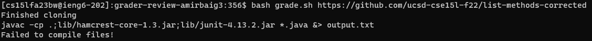
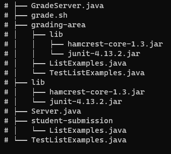

# Lab Report 5 - Putting It All Together  

## Part 1 - Debugging Scenario  
I could not think of a scenario (it's harder than it sounds) so I decided to reference a bug I had to fix myself.   

(1) In my grading script, all student submissions fail to compile, even the ones with no errors. My guess is some sort of typo since I am properly including the junit package.  
The error:   
```
TestListExamples.java:1: error: package org.junit does not exist  
import static org.junit.Assert.*;  
                       ^  
TestListExamples.java:2: error: package org.junit does not exist  
import org.junit.*;  
^  
TestListExamples.java:13: error: cannot find symbol  
  @Test(timeout = 500)  
   ^  
  symbol:   class Test  
  location: class TestListExamples  
TestListExamples.java:22: error: cannot find symbol  
  @Test(timeout = 500)  
   ^  
  symbol:   class Test  
  location: class TestListExamples  
TestListExamples.java:31: error: cannot find symbol  
  @Test(timeout = 500)  
   ^  
  symbol:   class Test  
  location: class TestListExamples  
TestListExamples.java:40: error: cannot find symbol  
  @Test(timeout = 500)  
   ^  
  symbol:   class Test  
  location: class TestListExamples  
TestListExamples.java:49: error: cannot find symbol  
  @Test  
   ^  
  symbol:   class Test  
  location: class TestListExamples  
TestListExamples.java:19: error: cannot find symbol  
    assertEquals(expected, merged);  
    ^  
  symbol:   method assertEquals(List<String>,List<String>)  
  location: class TestListExamples  
TestListExamples.java:28: error: cannot find symbol  
    assertEquals(expected, merged);  
    ^  
  symbol:   method assertEquals(List<String>,List<String>)  
  location: class TestListExamples  
TestListExamples.java:37: error: cannot find symbol  
    assertEquals(expected, merged);  
    ^  
  symbol:   method assertEquals(List<String>,List<String>)  
  location: class TestListExamples  
TestListExamples.java:46: error: cannot find symbol  
    assertEquals(expected, merged);  
    ^  
  symbol:   method assertEquals(List<String>,List<String>)  
  location: class TestListExamples  
TestListExamples.java:55: error: cannot find symbol  
    assertEquals(expected, filtered);  
    ^  
  symbol:   method assertEquals(List<String>,List<String>)  
  location: class TestListExamples  
12 errors  
```

grade.sh:  
```
rm -rf student-submission  
rm -rf grading-area  

mkdir grading-area  

git clone $1 student-submission &> /dev/null  
if [[ $? != 0 ]]  
then  
    echo 'Failed to clone repository!'  
    exit 1  
fi  
echo 'Finished cloning'  

if [[ ! -f ./student-submission/ListExamples.java ]]  
then  
    echo 'Expected "ListExamples.java" at root of repository, but was not found!'  
    exit 1  
fi  

cp -r lib/ student-submission/ListExamples.java TestListExamples.java grading-area    

cd grading-area  
CPATH='.;lib/hamcrest-core-1.3.jar;lib/junit-4.13.2.jar'  
javac -cp $CPATH *.java &> output.txt  

if [[ $? != 0 ]]  
then  
    echo 'Failed to compile files!'  
    exit 1  
fi  

java -cp $CPATH org.junit.runner.JUnitCore TestListExamples > test_output.txt  

grep -i "tests" test_output.txt  

```

TestListExamples.java:  
```
import static org.junit.Assert.*;  
import org.junit.*;  
import java.util.Arrays;  
import java.util.List;  

class IsMoon implements StringChecker {  
  public boolean checkString(String s) {  
    return s.equalsIgnoreCase("moon");  
  }   
}  

public class TestListExamples {
  @Test(timeout = 500)
  public void testMergeRightEnd() {
    List<String> left = Arrays.asList("a", "b", "c");
    List<String> right = Arrays.asList("a", "d");
    List<String> merged = ListExamples.merge(left, right);
    List<String> expected = Arrays.asList("a", "a", "b", "c", "d");
    assertEquals(expected, merged);
  }

  @Test(timeout = 500)
  public void testMergeLeftEnd() {
    List<String> left = Arrays.asList("a", "b", "d");
    List<String> right = Arrays.asList("a", "c");
    List<String> merged = ListExamples.merge(left, right);
    List<String> expected = Arrays.asList("a", "a", "b", "c", "d");
    assertEquals(expected, merged);
  }

  @Test(timeout = 500)
  public void testMergeRightNull() {
    List<String> left = Arrays.asList("a", "b", "c");
    List<String> right = Arrays.asList();
    List<String> merged = ListExamples.merge(left, right);
    List<String> expected = Arrays.asList("a", "b", "c");
    assertEquals(expected, merged);
  }

  @Test(timeout = 500)
  public void testMergeLeftNull() {
    List<String> left = Arrays.asList();
    List<String> right = Arrays.asList("a", "b", "c");
    List<String> merged = ListExamples.merge(left, right);
    List<String> expected = Arrays.asList("a", "b", "c");
    assertEquals(expected, merged);
  }

  @Test
  public void testFilterBasic() {
    List<String> input = Arrays.asList("spoon", "Moon", "nom", "moon", "half moon");
    List<String> expected = Arrays.asList("Moon", "moon");
    IsMoon sc = new IsMoon();
    List<String> filtered = ListExamples.filter(input, sc);
    assertEquals(expected, filtered);
  }
}
```

(2) The bug here is fairly strightforward, so here are some things to consider: since it's a compile error, try printing out the `javac` command with its arguments. Also, consider your environment and recall the differences between Windows and Linux.

(3) Following your advice, here is what I got:   
It seems I forgot to change the semicolons from my Windows machine to colons for the Linux ieng6 server. Making the edits, the programs runs as expected.  

(4) File structure:   
All other information included in other posts.

## Part 2 - Reflection
One thing I learned that I didn't know before is Vim. It was interesting to learn about because it is something referenced often within the programming community, but I never tried learning it on my own. I think Vim is great skill to have as a programmer and I hope to continue using it on my own time (or any programs related to it) it the hopes of becoming more effecient. 